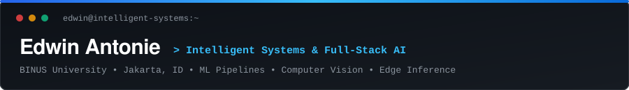
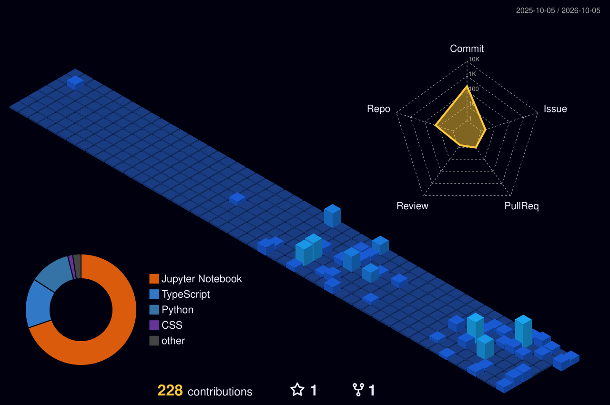

  
    

  

    &nbsp;
    &nbsp;
    
  

  

    
    
    
    
  

---

### About

I am an undergraduate Computer Science student specializing in **Intelligent Systems** at **Bina Nusantara University (BINUS)** in Jakarta. My focus is on turning raw data into robust, production-ready software—spanning reproducible machine learning pipelines, edge-efficient computer vision architectures, and type-safe full-stack AI applications.

---

#### Engineering Capabilities by Tier

<table>
  <thead>
    <tr>
      <th width="24%">Pipeline Tier</th>
      <th width="38%">Technologies & Frameworks</th>
      <th width="38%">Engineering Application</th>
    </tr>
  </thead>
  <tbody>
    <tr>
      <td><strong>Machine Learning & Modeling</strong></td>
      <td>
        
        
        
        
        
      </td>
      <td>
        Supervised & unsupervised learning, cost-sensitive tuning, multi-label failure diagnosis, and biometrics.
      </td>
    </tr>
    <tr>
      <td><strong>Computer Vision & NLP</strong></td>
      <td>
        
        
        
        
      </td>
      <td>
        Pixel-wise liveness gates, ArcFace facial embeddings, Donut OCR for scan extraction, and semantic vector retrieval (&lt;120ms).
      </td>
    </tr>
    <tr>
      <td><strong>Web Architecture & Serving</strong></td>
      <td>
        
        
        
        
        
      </td>
      <td>
        Type-safe client-server contracts, async API gateways, responsive dashboards, and interactive clinical diagnostic workflows.
      </td>
    </tr>
    <tr>
      <td><strong>Data, DevOps & Explainability</strong></td>
      <td>
        
        
        
        
        
      </td>
      <td>
        Relational persistence, containerized air-gapped on-premise deployments, reproducible experiments, and model explainability.
      </td>
    </tr>
  </tbody>
</table>

---

### Selected Engineering Work

<table>
  <tr>
    <td width="50%" valign="top">
      <h4><a href="https://github.com/QeekOw/CERA">InForm: Multimodal Health Intelligence</a></h4>
      <strong>Healthcare AI & Document Intelligence</strong> · <em>In Active Development</em>
      

        End-to-end platform extracting physical InBody body-composition scan sheets via Donut OCR to generate personalized, clinically validated nutrition and corrective exercise regimens.
      

      <ul>
        <li>Engineered a dual-validation client-server guard guaranteeing zero numerical hallucinations.</li>
        <li>88+ automated unit and contract tests passing across core calculation and API layers.</li>
      </ul>
      

        <code>Next.js</code> <code>FastAPI</code> <code>Donut OCR</code> <code>PyTorch</code> <code>PostgreSQL</code>
      

      

        <a href="https://github.com/QeekOw/CERA"><strong>Source Repository &rarr;</strong></a>
      

    </td>
    <td width="50%" valign="top">
      <h4><a href="https://github.com/EdwinAntoniee/Maintain-Dual-AI-Prescriptive-Maintenance">Maintain: Prescriptive Maintenance & Copilot</a></h4>
      <strong>Industrial AI</strong> · 🌟 Top 50 COMPFEST 18
      

        Predictive maintenance platform analyzing factory sensor telemetry to diagnose mechanical strain and generate safety-first repair standard operating procedures (SOPs).
      

      <ul>
        <li>Achieved 0.9850 ROC-AUC with 100% recall on critical failure modes (HDF, PWF, OSF).</li>
        <li>On-premise fine-tuned Qwen2.5-7B (QLoRA) assistant operating with zero cloud data leakage.</li>
      </ul>
      

        <code>LightGBM</code> <code>Qwen2.5-7B</code> <code>FastAPI</code> <code>Docker</code> <code>Scikit-Learn</code>
      

      

        <a href="https://github.com/EdwinAntoniee/Maintain-Dual-AI-Prescriptive-Maintenance"><strong>Source Repository &rarr;</strong></a>
      

    </td>
  </tr>
  <tr>
    <td width="50%" valign="top">
      <h4><a href="https://github.com/EdwinAntoniee/Research_FAS">Robust FAS: Biometric Verification & Liveness</a></h4>
      <strong>Computer Vision & Biometrics</strong> · University Research
      

        Edge-efficient biometric authentication framework coupling deep pixel-wise presentation attack detection with ArcFace facial recognition to resist physical spoofing attacks.
      

      <ul>
        <li>Achieved 3% Attack Classification Error Rate (ACER) on edge laptop webcams.</li>
        <li>Evaluated across standard OULU-NPU benchmark test protocols under extreme lighting.</li>
      </ul>
      

        <code>PyTorch</code> <code>MobileNetV2</code> <code>ArcFace</code> <code>OpenCV</code> <code>InsightFace</code>
      

      

        <a href="https://github.com/EdwinAntoniee/Research_FAS"><strong>Source Repository &rarr;</strong></a> &bull;
        <a href="https://www.youtube.com/watch?v=I_Dk0_qvTJ4"><strong>Video Demo &rarr;</strong></a>
      

    </td>
    <td width="50%" valign="top">
      <h4><a href="https://github.com/EdwinAntoniee/Moofy-Emotion-Aware-Movie-Recommendation">Moofy: Emotion-Aware Recommendation Engine</a></h4>
      <strong>NLP & Recommender Systems</strong> · Personal Project
      

        Recommendation system that maps natural-language user daily stories into emotional states and semantic film recommendations across 10,000+ TMDB movies.
      

      <ul>
        <li>Combined fine-tuned DistilBERT emotion scoring with Sentence-BERT semantic search.</li>
        <li>Sub-150ms inference latency powered by ChromaDB vector indexing and FastAPI.</li>
      </ul>
      

        <code>PyTorch</code> <code>DistilBERT</code> <code>ChromaDB</code> <code>FastAPI</code> <code>React</code>
      

      

        <a href="https://github.com/EdwinAntoniee/Moofy-Emotion-Aware-Movie-Recommendation"><strong>Source Repository &rarr;</strong></a>
      

    </td>
  </tr>
  <tr>
    <td width="50%" valign="top">
      <h4><a href="https://github.com/EdwinAntoniee/En-Garde-Tender-Anomaly-Detection">En Garde: Procurement Fraud Detection</a></h4>
      <strong>Explainable AI & Anomaly Detection</strong> · 🏅 11th Place Find IT! UGM
      

        Unsupervised anomaly detection system analyzing thousands of Open Contracting Data Standard (OCDS) tenders to flag price inflation, bid rigging, and corruption indicators.
      

      <ul>
        <li>Isolation Forest pipeline with Elbow-method mathematical contamination tuning.</li>
        <li>Integrated TreeSHAP waterfall visualizers enabling human auditors to inspect model decisions.</li>
      </ul>
      

        <code>Scikit-Learn</code> <code>Isolation Forest</code> <code>SHAP</code> <code>Pandas</code> <code>Plotly</code>
      

      

        <a href="https://github.com/EdwinAntoniee/En-Garde-Tender-Anomaly-Detection"><strong>Source Repository &rarr;</strong></a>
      

    </td>
    <td width="50%" valign="top">
      <h4><a href="https://users-behaviour-analyzer.streamlit.app/">Shopper Purchase Intention Analyzer</a></h4>
      <strong>Predictive Modeling & E-Commerce</strong> · Top Score Final Project
      

        Interactive machine learning platform forecasting user purchasing intentions from clickstream navigation sessions, deployed for real-time inference.
      

      <ul>
        <li>Mitigated 84.5% class imbalance using SMOTE and Yeo-Johnson power transformations.</li>
        <li>Achieved 0.8713 ROC-AUC across 12,330 e-commerce user sessions.</li>
      </ul>
      

        <code>Streamlit</code> <code>XGBoost</code> <code>Scikit-Learn</code> <code>Pandas</code> <code>Seaborn</code>
      

      

        <a href="https://users-behaviour-analyzer.streamlit.app/"><strong>Live Application &rarr;</strong></a> &bull;
        <a href="https://github.com/EdwinAntoniee/users-behaviour-analyzer"><strong>Repository &rarr;</strong></a>
      

    </td>
  </tr>
</table>

<strong>View Additional Projects & Experiments</strong>

 

- **[Diabetes Risk Predictor](https://diabetesprediction-program-assignment-ml.streamlit.app)**: Interactive clinical screening application benchmarking Random Forest, SVM, and Logistic Regression with leak-free preprocessing. `Streamlit` `Scikit-Learn` `Python`
- **[Repeat Order Prediction](https://github.com/EdwinAntoniee/SPARC-Repeat-Order-Prediction)**: Cost-sensitive LightGBM customer retention pipeline on 319,000+ automotive financing records (🏆 National Finalist, SPARC 2026). `LightGBM` `Pandas` `Scikit-Learn`

---

### Honors & Competitions

| Recognition | Event / Organizer | Project | Focus |
|---|---|---|---|
| **Top 50 Nationwide** | COMPFEST 18 &bull; Universitas Indonesia (2026) | *Maintain* | AI Innovation Challenge & Prescriptive Telemetry |
| **11th Place Nationwide** | Find IT! 2026 Hackathon &bull; Universitas Gadjah Mada (2026) | *En Garde* | Unsupervised Tender Fraud Detection & Explainable AI |
| **National Finalist** | SPARC 2026 Data Science &bull; Universitas Ciputra (2026) | *Repeat Order* | Cost-Sensitive Automotive Retention Modeling |

---

### Certifications

- **Microsoft Elevate AI: Azure AI Fundamentals (AI-900T00-A)** &bull; Microsoft & GreatNusa *(2026)*
- **Maju Bareng AI: LLM-Based Tools & Gemini API Integration** &bull; Hacktiv8 Indonesia *(2026)*
- **N8N and AI Integration** &bull; Taalenta *(2026)*
- **AI Application Bootcamp & Python Bootcamp** &bull; Skill Academy by Ruangguru *(2025)*
- **Fundamentals of Deep Learning** &bull; NVIDIA *(2024)*
- **Front-End Development Course** &bull; Bina Nusantara Computer Club (BNCC) *(2024)*

---

### GitHub Activity

  <table border="0">
    <tr>
      <td valign="top" width="50%">
        
      </td>
      <td valign="top" width="50%">
        
      </td>
    </tr>
    <tr>
      <td colspan="2" align="center">
        
      </td>
    </tr>
  </table>

   

  

    

  

    <a href="https://edwinantonie.vercel.app">Explore complete project writeups and interactive prototypes on my portfolio &rarr;</a>
  

